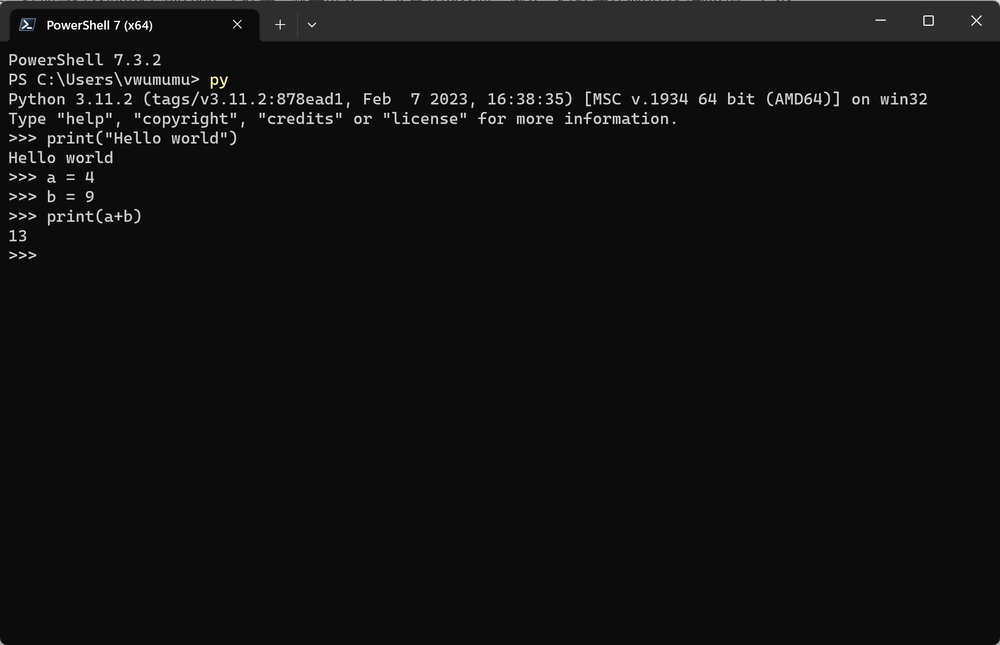

:::tip 提示
**这一课最好不学**，因为陌生的名词太多，让新手头疼。

如果，想学，大概过一遍就可以，对文章的内容有个印象就可以了。

非要学点什么，可以试着理解一下什么是解释器和解释运行（其实现在记住了，也还是感受不到知道不知道有什么区别，有什么用处）
:::

:::info 信息
[教材](../pilot/p1-1-understanding-programming-languages.md)
[视频](https://www.bilibili.com/video/BV1Jo4y1Y7SC/?vd_source=4a888db8814702b2062fcaf2575be745)
:::

## 解释器和解释运行

> 这种输入一行执行一行的界面有个通用的名字叫做 *REPL*（*read–eval–print loop* 的缩写），意思是这个程序可以读取（*read*）你的输入、计算（*evaluate*）、然后打印（*print*）结果，循环往复，直到你退出——在上图的界面中，输入 `exit()` 回车，就可以退出 Python 的 *REPL*。

