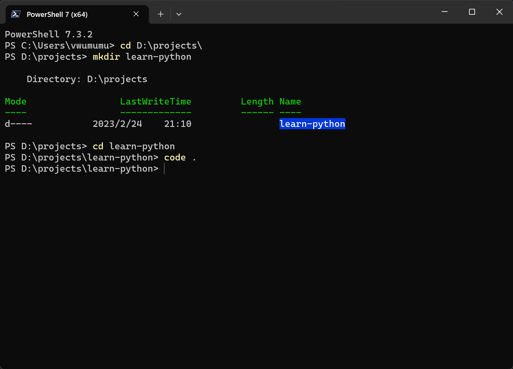
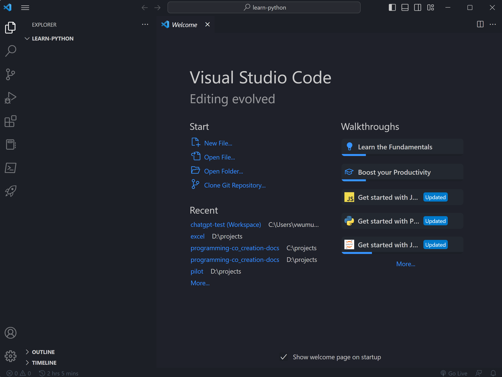
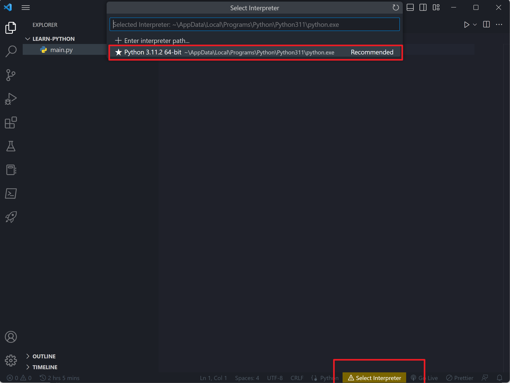
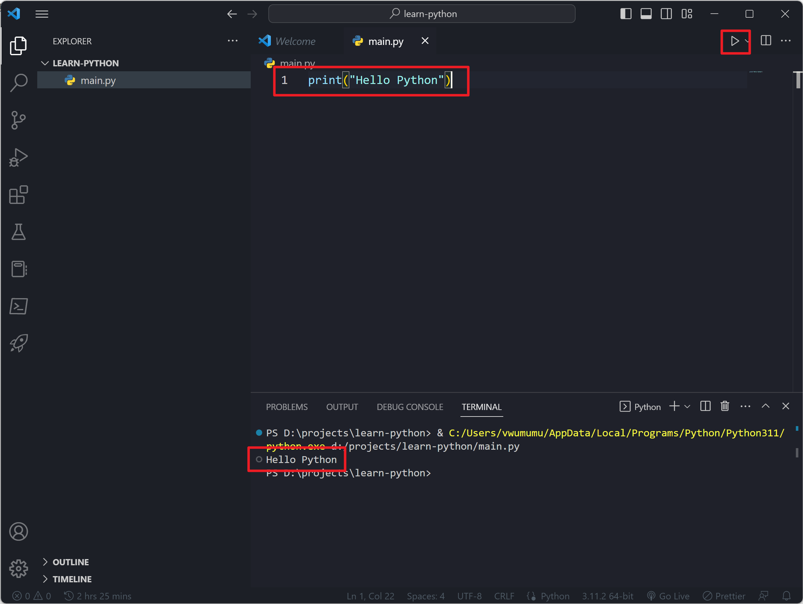

## 1.什么是IDE

下面是维基百科关于IDE的中文释义：

> 集成开发环境（Integrated Development Environment，简称IDE，也称为Integration Design Environment、Integration Debugging Environment）是一种辅助程序开发人员开发软件的应用软件，在开发工具内部就可以辅助编写源代码文本、并编译打包成为可用的程序，有些甚至可以设计图形接口。

简单说，就是我们平时写代码的“地方”。

在我们后面我们使用VSCode作为我们的IDE。VSCode是一款开源的，使用广泛的IDE，支持很多第三方插件，可以让VSCode更好的适用于特定的编程环境。

## 2.安装VSCode

1. 进入VSCode的 [下载页面](https://code.visualstudio.com/Download) ，点击红色方框内的“Windows”下载样式的按钮：

   


2. 页面会自动跳转，并弹出下载窗口，点击另存为，将VSCode的安装包保存到本地，比如，保存到桌面：

   

3. 打开安装包，一路下一步，按默认选项安装，在这里，着重强调一下，下面红框的内容要确保勾选，其中最后一项决定着我们可以在命令行中，通过命令`code .`，将当前目录，用VSCode打开：

   


## 3.在VSCode中编写，运行Python代码

1. 在命令行中执行下面的命令：

   假如，你有D盘，你的D盘有一个名为projects的文件夹.....，如果没有，请换成别的文件夹

   ```powershell
   cd d:\projects\
   mkdir learn-python
   cd learn-python
   code .
   ```

   

2. 然后，我们就用VSCode打开了learn-python这个文件夹：

   

3. 我们新建一个文件，名为main.py:

   

4. 页面底部会要求我们选择“Interpreter”编译器，然后选择页面顶部弹出的Python 3.XX.X：

   

5. 下面，我们把 《[6.第一段Python代码](../p0/p0-6-python.md)》 一课中的代码用VSCode再写一遍，执行一遍：

   在代码编写的区域键入`print("Hello Python")`，点击右上角的“”运行按钮，可以在页面底部看到代码运行的结果：Hello Python

   


## 作业

这一篇，我们留个作业，把前面已经涉及过的Python代码，原来在PowerShell中，通过Python解释器直接运行的代码，在VSCode中再试一次。

请将结果，VSCode结果截图回复到该Github Issues中：[作业：1-3-IDE集成开发环境 · Issue #27](https://github.com/coding-newbies-group/programming-co_creation-docs/issues/27)
